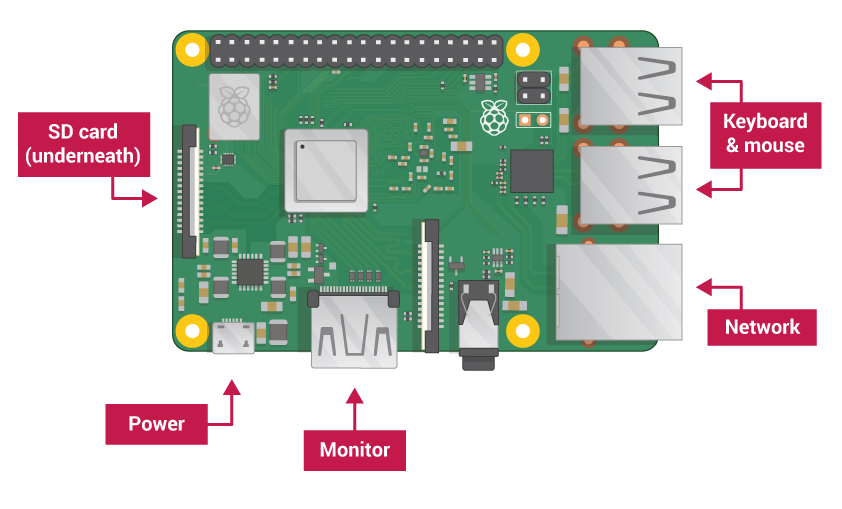
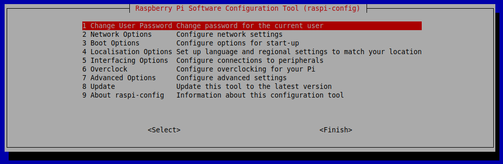
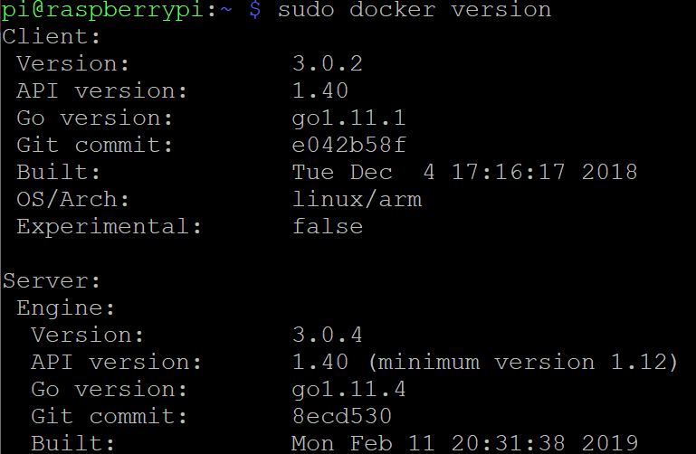

# Play MXChip IoT DevKit as a leaf device with Azure IoT Edge on Raspberry Pi 3

## Prerequisites
**Raspberry Pi 3**

- [Raspberry Pi 3 Model B+](https://www.raspberrypi.org/products/raspberry-pi-3-model-b-plus/).
- A 16 / 32 GB micro SD card. Please check the [SD card requirements](https://www.raspberrypi.org/documentation/installation/sd-cards.md) for more information.
- A micro SD card reader.
- A keyboard.
- A screen and a cable.

**MXChip IoT DevKit**
Finish the [Getting Started Guide](https://github.com/Microsoft/vscode-iot-workbench/blob/master/docs/iot-devkit/devkit-get-started.md) to:

- Have your DevKit connected to Wi-Fi.
- Prepare the development environment.

**An active Azure subscription**
If you do not have one, you can register via one of these two methods:

  - Activate a [free 30-day trial Microsoft Azure account](https://azure.microsoft.com/free/).
  - Claim your [Azure credit](https://azure.microsoft.com/pricing/member-offers/msdn-benefits-details/) if you are MSDN or Visual Studio subscriber.

**Network**

First need internet access.
Then we recommend users connect Raspberry Pi, MXChip IoT DevKit and the desktop / laptop you used for developing to the same AP / router, all under the same network segment makes the whole experiment much easier.

## Setting up your Raspberry Pi

Consider to have a clean installed Raspbian, if you already have one please skip this chapter and start the [experiment](#use-raspberry-pi-as-a-transparent-gateway).

### Install Operation System

We recommend users install Raspbian instead of [NOOBS](https://www.raspberrypi.org/documentation/installation/noobs.md) since IoT Edge doesn't need rich features that NOOBS provides, and the [Raspbain Stretch Lite](https://downloads.raspberrypi.org/raspbian_lite_latest) is good enough for us to configure Raspberry Pi as an Azure IoT Edge, it's small which can save much resources for IoT Edge.

> If you like NOOBS, please setup your Raspberry Pi by following is [Turtorial](https://projects.raspberrypi.org/en/projects/raspberry-pi-setting-up).

Take following steps to install Raspbian:

- Download the [Raspbain Stretch Lite](https://downloads.raspberrypi.org/raspbian_lite_latest) image from the Raspberry Pi website [Donwloads page](https://www.raspberrypi.org/downloads/raspbian/).

- Download [Etcher](https://www.balena.io/etcher/) and install.

- Connect your SD card reader with the micro SD card inside.

- Open Etcher and select the Raspberry Pi `.img` or `.zip` file you download and with to write to the micro SD card.

- Select the SD card you with to write your image to.

- Review your selections and click 'Flash!' to begin writing data to the SD card.

  This might take several mins which depends on the speed of the SD card reader and  micro SD card.

> For more information, please check this the Raspberry Pi website [Installing operation system images](https://www.raspberrypi.org/documentation/installation/installing-images/README.md).

### Start up your  Raspberry Pi

Your Raspberry Pi doesn’t have a power switch: as soon as you connect it to a power outlet, it will turn on.



  - Insert the micro SD card you've setup into the micros SD card slot at the underside of your Pi.
  - Connect the keyboard to a USB port on the Raspberry Pi. 
  - Use a cable to connect the screen to the Pi's HDMI port.
  - Use an Ethernet cable to connect the Ethernet port on the Raspberry Pi if you want to connect the Pi to the internet via Ethernet (You don’t need to do this if you’ll be using WiFi).
  - Plug a micro USB power supply into a socket and connect it to you Pi's power port.


Now you should see a red LED light up on the Raspberry Pi, which indicates that the Pi is connected to power. As it starts up (this is also called **booting**), you will see raspberries appear in the top left-hand of your screen.


### Configue your  Raspberry Pi

When you start your Raspberry Pi for the first time, the default user is `pi` and the password is `raspberry`.
Once login, run the `sudo raspi-config` to finish the initial setup:



- Change user Password

  Consider to change the default password of `pi`.

- Network Options

  Please setup the WiFi if not connect the Pi to the internet via Ethernet. 
  
- Enable SSH

  The SSH is disabled by default, go to **Interfacing Options** and enable it for further actions.

- Finish

  Pressing `<right>` arrow key and jump out of the Options menu and take to the `<Select>` and `<Finish>` buttons. Select the `<Finish>` button to  exist the `raspi-config` UI.

> If you installed the operating system via NOOBS, the [Welcome to Raspberry Pi](https://projects.raspberrypi.org/en/projects/raspberry-pi-setting-up/6) application will popup and guide you through the initial setup.

## Configure the Raspberry Pi as an Azure IoT Edge Device

Assuming you have your Raspberry Pi connected to the same network as your development machine, SSH into it.

- Install the container runtime

  ```bash
  # You can copy the entire text from this code block and 
  # paste in terminal. The comment lines will be ignored.
  
  # Download and install the moby-engine
  curl -L https://aka.ms/moby-engine-armhf-latest -o moby_engine.deb && sudo dpkg -i ./moby_engine.deb
  
  # Download and install the moby-cli
  curl -L https://aka.ms/moby-cli-armhf-latest -o moby_cli.deb && sudo dpkg -i ./moby_cli.deb
  
  # Run apt-get fix
  sudo apt-get install -f
  ```

  Make sure Moby and CLI are installed properly:
  `sudo docker version`
  
  
  
- Install the IoT Edge Security Daemon

  ```bash
  # Download and install the standard libiothsm implementation
  curl -L https://aka.ms/libiothsm-std-linux-armhf-latest -o libiothsm-std.deb && sudo dpkg -i ./libiothsm-std.deb
  
  # Download and install the IoT Edge Security Daemon
  curl -L https://aka.ms/iotedged-linux-armhf-latest -o iotedge.deb && sudo dpkg -i ./iotedge.deb
  
  # Run apt-get fix
  sudo apt-get install -f
  ```

- Connect your device to an IoT hub


> For more information, please check Microsoft Azure website  [**Install Azure IoT Edge runtime on Linux**](https://docs.microsoft.com/en-us/azure/iot-edge/how-to-install-iot-edge-linux-arm) .


## Use Raspberry Pi as a Transparent Gateway


## Use Paspberry Pi as a Protocol Translation Gateway