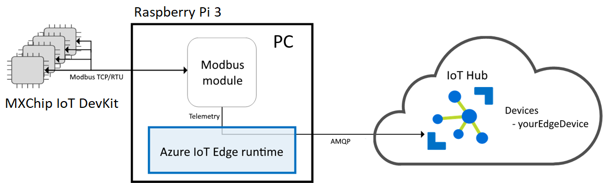

# Play MXChip IoT DevKit as a leaf device with Azure IoT Edge on Raspberry Pi 3

You can use the [MXChip IoT DevKit](https://aka.ms/devkit) as a leaf device to connect to a Raspberry Pi 3 which is configured to a Azure IoT Edge device.

## What you do

In this article, you will configure a Raspberry Pi 3 as a Azure IoT Edge device, then try 2 different gateway mode: **Transparent Gateway** and **Protocol Translation Gateway**.
And the MXChip IoT DevKit is used as a leaf device that connect to the Raspberry Pi 3.


## Prerequisites

- Raspberry Pi 3
  - [Raspberry Pi 3 Model B+](https://www.raspberrypi.org/products/raspberry-pi-3-model-b-plus/).
  - A 16 / 32 GB micro SD card. Please check the [SD card requirements](https://www.raspberrypi.org/documentation/installation/sd-cards.md) for more information.
  - A micro SD card reader.
  - A keyboard.
  - A screen and a cable.
- MXChip IoT DevKit
  - Finish the [Getting Started Guide](https://docs.microsoft.com/en-us/azure/iot-hub/iot-hub-arduino-iot-devkit-az3166-get-started) .
  - Have your IoT DevKit connected to Wi-Fi.
  Don't have a **MXChip IoT DevKit** yet? [Purchase one](https://aka.ms/iot-devkit-purchase).
- Prepare the development environment
  - Install [Visual Studio Code](https://code.visualstudio.com/).
  - Install [Azure IoT Tools extension pack](https://aka.ms/azure-iot-tools).
- An active Azure subscription

  If you do not have one, you can register via one of these two methods:

    - Activate a [free 30-day trial Microsoft Azure account](https://azure.microsoft.com/free/).
    - Claim your [Azure credit](https://azure.microsoft.com/pricing/member-offers/msdn-benefits-details/) if you are MSDN or Visual Studio subscriber.

### Network

First need internet access.
Then we recommend users connect Raspberry Pi, MXChip IoT DevKit and the desktop / laptop you used for developing to the same AP / router, all under the same network segment makes the whole experiment much easier.

## Setting up your Raspberry Pi

Consider to have a clean installed Raspbian, if you already have one please skip this chapter and start the [experiment](#use-raspberry-pi-as-a-transparent-gateway).

### Install Operation System

We recommend users install Raspbian instead of [NOOBS](https://www.raspberrypi.org/documentation/installation/noobs.md) since IoT Edge doesn't need rich features that NOOBS provides, and the [Raspbain Stretch Lite](https://downloads.raspberrypi.org/raspbian_lite_latest) is good enough for us to configure Raspberry Pi as an Azure IoT Edge, it's small which can save much resources for IoT Edge.

> You can also setup your Raspberry Pi by using NOOBS by following this [Turtorial](https://projects.raspberrypi.org/en/projects/raspberry-pi-setting-up).

Take following steps to install Raspbian:

- Download the [Raspbain Stretch Lite](https://downloads.raspberrypi.org/raspbian_lite_latest) image from the Raspberry Pi website [Donwloads page](https://www.raspberrypi.org/downloads/raspbian/).
- Download [Etcher](https://www.balena.io/etcher/) and install.
- Connect your SD card reader with the micro SD card inside.
- Open Etcher and select the Raspberry Pi `.img` or `.zip` file you download and with to write to the micro SD card.
- Select the SD card you with to write your image to.
- Review your selections and click 'Flash!' to begin writing data to the SD card.
  This might take several mins which depends on the speed of the SD card reader and  micro SD card.

> For more information, please check this the Raspberry Pi website [Installing operation system images](https://www.raspberrypi.org/documentation/installation/installing-images/README.md).

### Start up your  Raspberry Pi

Your Raspberry Pi doesn’t have a power switch: as soon as you connect it to a power outlet, it will turn on.


  - Insert the micro SD card you've setup into the micros SD card slot at the underside of your Pi.
  - Connect the keyboard to a USB port on the Raspberry Pi. 
  - Use a cable to connect the screen to the Pi's HDMI port.
  - Use an Ethernet cable to connect the Ethernet port on the Raspberry Pi if you want to connect the Pi to the internet via Ethernet (You don’t need to do this if you’ll be using WiFi).
  - Plug a micro USB power supply into a socket and connect it to you Pi's power port.


Now you should see a red LED light up on the Raspberry Pi, which indicates that the Pi is connected to power. As it starts up (this is also called **booting**), you will see raspberries appear in the top left-hand of your screen.


### Configure your  Raspberry Pi

When you start your Raspberry Pi for the first time, the default user is `pi` and the password is `raspberry`.
Once login, run the `sudo raspi-config` to finish the initial setup:


- Change user Password
  Consider to change the default password of `pi`.
- Network Options
  Please setup the WiFi if not connect the Pi to the internet via Ethernet. 
- Enable SSH
  The SSH is disabled by default, go to **Interfacing Options** and enable it for further actions.
- Finish
  Pressing **ESC** key to  exist the `raspi-config` UI.

> If you installed the operating system via NOOBS, the [Welcome to Raspberry Pi](https://projects.raspberrypi.org/en/projects/raspberry-pi-setting-up/6) application will popup and guide you through the initial setup.

## Configure the Raspberry Pi as an Azure IoT Edge Device

### Register a new Azure IoT Edge device from the Azure portal

Please create a [Azure IoT Hub](https://docs.microsoft.com/en-us/azure/iot-hub/iot-hub-create-through-portal) if you don't have one for resgister new Azure IoT Edge device.

- Register
  - Sign in to the [Azure portal](https://portal.azure.com/) and navigate to your IoT hub.
  - Select **IoT Edge** from the menu.
  - Select **Add an IoT Edge device**.
  - Provide a descriptive device ID. Use the default settings for auto-generating authentication keys and connecting the new device to your hub.
  - Select **Save**.
- Copy device connection string
  Click the IoT Edge device you created, copy the value of either **Connection string (primary key)** or **Connection string (secondary key)**.
  > For more information, please check Microsoft Azure website  [**Register a new Azure IoT Edge device from the Azure portal**](https://docs.microsoft.com/en-us/azure/iot-edge/how-to-register-device-portal) .
  > 
### Install Azure IoT Edge runtime on Raspberry Pi

Assuming you have your Raspberry Pi connected to the same network as your development machine, SSH into it.

- Install the container runtime

  ```bash
  # You can copy the entire text from this code block and 
  # paste in terminal. The comment lines will be ignored.
  
  # Download and install the moby-engine
  curl -L https://aka.ms/moby-engine-armhf-latest -o moby_engine.deb && sudo dpkg -i ./moby_engine.deb
  
  # Download and install the moby-cli
  curl -L https://aka.ms/moby-cli-armhf-latest -o moby_cli.deb && sudo dpkg -i ./moby_cli.deb
  
  # Run apt-get fix
  sudo apt-get install -f
  ```

  Make sure Moby and CLI are installed properly:
  `sudo docker version`

  

- Install the IoT Edge Security Daemon

  ```bash
  # Download and install the standard libiothsm implementation
  curl -L https://aka.ms/libiothsm-std-linux-armhf-latest -o libiothsm-std.deb && sudo dpkg -i ./libiothsm-std.deb
  
  # Download and install the IoT Edge Security Daemon
  curl -L https://aka.ms/iotedged-linux-armhf-latest -o iotedge.deb && sudo dpkg -i ./iotedge.deb
  
  # Run apt-get fix
  sudo apt-get install -f
  ```

- Connect your device to an IoT hub

  Open the IoT Edege configuration file on Raspberry PI.

  ```bash
  sudo chmod +rw /etc/iotedge/config.yaml
  sudo nano /etc/iotedge/config.yaml
  ```

  Find the provisioning section of the file and uncomment the **manual** provisioning mode. Update the value of **device_connection_string** with the connection string from your IoT Edge device.

  ```bash
  provisioning:
  source: "manual"
  device_connection_string: "<ADD DEVICE CONNECTION STRING HERE>"
  
  # provisioning: 
  #   source: "dps"
  #   global_endpoint: "https://global.azure-devices-provisioning.net"
  #   scope_id: "{scope_id}"
  #   registration_id: "{registration_id}"
  ```

  Save and close the file.
  `CTRL + X, Y, Enter`
  After entering the provisioning information in the configuration file, restart the daemon:

  ```bash
  sudo systemctl restart iotedge
  ```

- Verify successful installation
  If you configured your Raspberry PI in the previous section, the IoT Edge runtime should be successfully provisioned and running on your Raspberry Pi.
  
  You can check the status of the IoT Edge Daemon using:
  
  ```bash
  systemctl status iotedge
  ```

  Examine daemon logs using:

  ```bash
  journalctl -u iotedge --no-pager --no-full
  ```

  And, list running modules with:

  ```bash
  sudo iotedge list
  ```

> For more information, please check Microsoft Azure website  [**Install Azure IoT Edge runtime on Linux**](https://docs.microsoft.com/en-us/azure/iot-edge/how-to-install-iot-edge-linux-arm).

## Use Raspberry Pi as a Transparent Gateway

 

The Raspberry Pi 3 is configured to function as a transparent gateway, simply passes communications between the devices and IoT Hub.
The MXChip IoT DevKit has its own IoT Hub identities and is using MQTT protocol,  unaware that IoT DevKit is communicating with the cloud via the Raspberry Pi 3 and a user interacting with the device in IoT Hub is unaware of the Raspberry Pi 3 gateway.

### Generate certificates

Use the development machine to generate the certificates, and then copy them over to your Raspberry Pi 3.

> **Note:**
> The "**gateway name**" used to create the certificates in this instruction, needs to be the same name as used as **hostname** in your IoT Edge config.yaml file and as **GatewayHostName** in the connection string of the downstream device. The "gateway name" needs to be resolvable to an IP Address, either using DNS or a host file entry. Communication based on the protocol used (MQTTS:8883/AMQPS:5671/HTTPS:433) must be possible between downstream device (MXChip IoT DevKit) and the transparent IoT Edge (Raspberry Pi 3). If a firewall is in between, the respective port needs to be open.

- Generate certificates with Windows
- Generate certificates with Linux


## Use Paspberry Pi as a Protocol Translation Gateway



The Raspberry Pi 3 is configured to function as a translation gateway, reads data from MXChip IoT DevKit which is running as a Modbus server, then communicates that data to the cloud using a supported protocol.