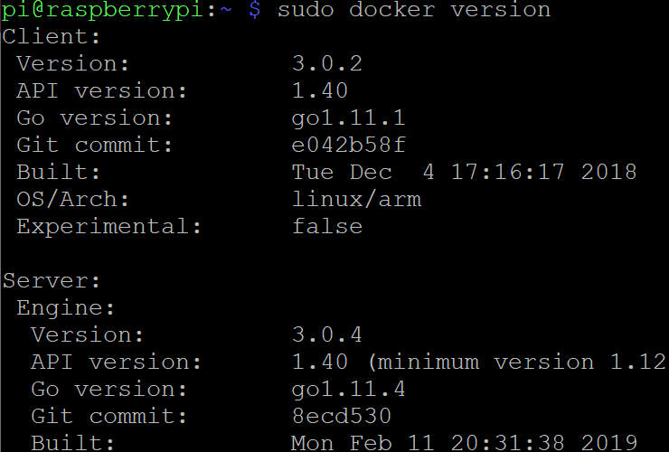
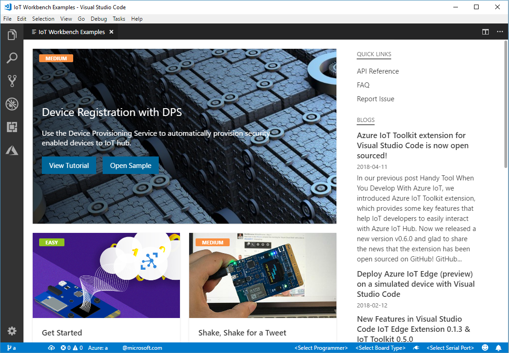
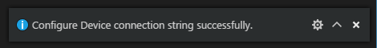

# Play MXChip IoT DevKit as a leaf device with Azure IoT Edge on Raspberry Pi 3

You can use the [MXChip IoT DevKit](https://aka.ms/devkit) as a leaf device to connect to a Raspberry Pi 3 which is configured to a Azure IoT Edge device.

## What you do

In this article, you will configure a Raspberry Pi 3 as a Azure IoT Edge device, which is configured as a **Transparent Gateway**.
And the MXChip IoT DevKit is used as a leaf device that connect to the IoT Edge device -  Raspberry Pi 3.


## Prerequisites

- Raspberry Pi 3
  - [Raspberry Pi 3 Model B+](https://www.raspberrypi.org/products/raspberry-pi-3-model-b-plus/).
  - A 16 / 32 GB micro SD card. Please check the [SD card requirements](https://www.raspberrypi.org/documentation/installation/sd-cards.md) for more information.
  - A micro SD card reader.
  - A keyboard.
  - A screen and a cable.

- MXChip IoT DevKit
  - Finish the [Getting Started Guide](https://docs.microsoft.com/en-us/azure/iot-hub/iot-hub-arduino-iot-devkit-az3166-get-started) .
  - Have your IoT DevKit connected to Wi-Fi.
  Don't have a **MXChip IoT DevKit** yet? [Purchase one](https://aka.ms/iot-devkit-purchase).

- Prepare the development environment
  - Install [Visual Studio Code](https://code.visualstudio.com/).
  - Install [Azure IoT Tools extension pack](https://aka.ms/azure-iot-tools).

- An active Azure subscription

  If you do not have one, you can register via one of these two methods:

    - Activate a [free 30-day trial Microsoft Azure account](https://azure.microsoft.com/free/).
    - Claim your [Azure credit](https://azure.microsoft.com/pricing/member-offers/msdn-benefits-details/) if you are MSDN or Visual Studio subscriber.

- Network

  There are 3 devices in this example:

  - One Raspberry Pi as a Azure IoT Edge device.
  - One MXChip IoT DevKit as a leaf device.
  - One laptop / desktop as you working machine.

  First please make sure the Raspberry Pi and your working machine can access Internet and Azure, then all these 3 devices are connecting to the same AP / router and under in the same subnetwork,  this will make the whole experiment much smooth.

## Setting up your Raspberry Pi

Consider to have a clean installed Raspbian, if you already have one please skip this chapter and start from the [experiment](#use-raspberry-pi-as-a-transparent-gateway) chapter directly.

### Install Operation System

We recommend to install Raspbian instead of [NOOBS](https://www.raspberrypi.org/documentation/installation/noobs.md) since IoT Edge doesn't need so much components and features that NOOBS provides, and the [Raspbain Stretch Lite](https://downloads.raspberrypi.org/raspbian_lite_latest) is good enough for us to configure Raspberry Pi as an Azure IoT Edge, it's small which can save much resources for IoT Edge.

> You can setup your Raspberry Pi by using NOOBS by following this [Turtorial](https://projects.raspberrypi.org/en/projects/raspberry-pi-setting-up).

Take following steps to install Raspbian:

- Download the [Raspbain Stretch Lite](https://downloads.raspberrypi.org/raspbian_lite_latest) image from the Raspberry Pi website [Donwloads page](https://www.raspberrypi.org/downloads/raspbian/).
- Download [Etcher](https://www.balena.io/etcher/) and install.
- Connect your SD card reader with the micro SD card inside.
- Open Etcher and select the Raspberry Pi `.img` or `.zip` file you download and with to write to the micro SD card.
- Select the SD card you with to write your image to.
- Review your selections and click 'Flash!' to begin writing data to the SD card.
  This might take several mins which depends on the speed of the SD card reader and  micro SD card.

> For more information, please check this the Raspberry Pi website [Installing operation system images](https://www.raspberrypi.org/documentation/installation/installing-images/README.md).

### Start up your  Raspberry Pi

> Your Raspberry Pi doesn’t have a power switch: as soon as you connect it to a power outlet, it will turn on.


  - Insert the micro SD card you've setup into the micros SD card slot at the underside of your Pi.
  - Connect the keyboard to a USB port on the Raspberry Pi. 
  - Use a cable to connect the screen to the Pi's HDMI port.
  - Use an Ethernet cable to connect the Ethernet port on the Raspberry Pi if you want to connect the Pi to the internet via Ethernet (You don’t need to do this if you’ll be using WiFi).
  - Plug a micro USB power supply into a socket and connect it to you Pi's power port.


Now you should see a red LED light up on the Raspberry Pi, which indicates that the Pi is connected to power. As it starts up (this is also called **booting**), you will see raspberries appear in the top left-hand of your screen.


### Configure your  Raspberry Pi

When you start your Raspberry Pi for the first time, the default user is `pi` and the password is `raspberry`.
Once login, run the `sudo raspi-config` to finish the initial setup:


- Change user Password
  Consider to change the default password of `pi`, that can make your device much safe.
- Network Options
  Please setup the Wi-Fi if not use Ethernet. 
- Enable SSH
  The SSH is disabled by default, go to **Interfacing Options** and enable it for further actions.
- Finish
  Pressing **ESC** key to  exist the `raspi-config` UI.

> If you installed the operating system via NOOBS, the [Welcome to Raspberry Pi](https://projects.raspberrypi.org/en/projects/raspberry-pi-setting-up/6) application will popup and guide you through the initial setup.

## Configure the Raspberry Pi as an Azure IoT Edge Device

### Register a new Azure IoT Edge device from the Azure portal

Please create a [Azure IoT Hub](https://docs.microsoft.com/en-us/azure/iot-hub/iot-hub-create-through-portal) if you don't have one for resgister new Azure IoT Edge device.

- Register
  - Sign in to the [Azure portal](https://portal.azure.com/) and navigate to your IoT hub.

  - Select **IoT Edge** from the menu.

    

  - Select **Add an IoT Edge device**.

    

  - Provide a descriptive device ID. Use the default settings for auto-generating authentication keys and connecting the new device to your hub. Then click **Save** to finish the registration.

    

- Copy device connection string
  Click the IoT Edge device you created, copy the value of either **Connection string (primary key)** or **Connection string (secondary key)**.

  

  > For more information, please check Microsoft Azure website  [**Register a new Azure IoT Edge device from the Azure portal**](https://docs.microsoft.com/en-us/azure/iot-edge/how-to-register-device-portal) .
  > 
### Install Azure IoT Edge runtime on Raspberry Pi

To config your Raspberry Pi as an Azure IoT Edge device, the first step is installing Azure IoT Edge runtime:

- Install the container runtime, here IoT Edge use [Moby engine](https://mobyproject.org/).

  ```bash
  # You can copy the entire text from this code block and 
  # paste in terminal. The comment lines will be ignored.
  
  # Download and install the moby-engine
  curl -L https://aka.ms/moby-engine-armhf-latest -o moby_engine.deb && sudo dpkg -i ./moby_engine.deb
  
  # Download and install the moby-cli
  curl -L https://aka.ms/moby-cli-armhf-latest -o moby_cli.deb && sudo dpkg -i ./moby_cli.deb
  
  # Run apt-get fix
  sudo apt-get install -f
  ```

  Make sure Moby and CLI are installed properly:
  `sudo docker version`

  

- Install the IoT Edge Security Daemon

  ```bash
  # Download and install the standard libiothsm implementation
  curl -L https://aka.ms/libiothsm-std-linux-armhf-latest -o libiothsm-std.deb && sudo dpkg -i ./libiothsm-std.deb
  
  # Download and install the IoT Edge Security Daemon
  curl -L https://aka.ms/iotedged-linux-armhf-latest -o iotedge.deb && sudo dpkg -i ./iotedge.deb
  
  # Run apt-get fix
  sudo apt-get install -f
  ```

- Connect your device to an IoT hub

  Open the IoT Edge configuration file on Raspberry Pi.

  ```bash
  sudo chmod +rw /etc/iotedge/config.yaml
  sudo nano /etc/iotedge/config.yaml
  ```

  Find the provisioning section of the file and uncomment the **manual** provisioning mode. Update the value of **device_connection_string** with the connection string from your IoT Edge device.

  ```bash
  provisioning:
  source: "manual"
  device_connection_string: "<ADD DEVICE CONNECTION STRING HERE>"
  
  # provisioning: 
  #   source: "dps"
  #   global_endpoint: "https://global.azure-devices-provisioning.net"
  #   scope_id: "{scope_id}"
  #   registration_id: "{registration_id}"
  ```

  Save and close the file.
  `CTRL + X, Y, Enter`
  After entering the provisioning information in the configuration file, restart the daemon:

  ```bash
  sudo systemctl restart iotedge
  ```

- Verify successful installation
  If you configured your Raspberry Pi in the previous section, the IoT Edge runtime should be successfully provisioned and running on your Raspberry Pi.

  You can check the status of the IoT Edge Daemon using:

  ```bash
  systemctl status iotedge
  ```

  Examine daemon logs using:

  ```bash
  journalctl -u iotedge --no-pager --no-full
  ```

  And, list running modules with:

  ```bash
  sudo iotedge list
  ```

  And, check the version:
  
  ```bash
  iotedge version
  ```

> For more information, please check Microsoft Azure website  [**Install Azure IoT Edge runtime on Linux**](https://docs.microsoft.com/en-us/azure/iot-edge/how-to-install-iot-edge-linux-arm). 

Until now you have configured your Raspberry Pi as an Azure IoT Edge device  

## Use Raspberry Pi as a Transparent Gateway

 

The Raspberry Pi 3 is configured to function as a transparent gateway, simply passes communications between the devices and IoT Hub.

### Generate certificates

Use the steps in this section to generate test certificates on Raspberry Pi 3 . 

#### Prepare creation scripts

1. Clone the git repo that contains scripts to generate non-production certificates. These scripts help you create the necessary certificates to set up a transparent gateway.

   ```bash
   git clone https://github.com/Azure/azure-iot-sdk-c.git
   ```

2. Navigate to the directory in which you want to work. We'll refer to this directory as *<WRKDIR>*.  All files will be created in this directory.

3. Copy the config and script files into your working directory.


   ```bash
   cp <path>/azure-iot-sdk-c/tools/CACertificates/*.cnf .
   cp <path>/azure-iot-sdk-c/tools/CACertificates/certGen.sh .
   ```

4. Configure OpenSSL to generate certificates using the provided script.


   ```bash
   chmod 700 certGen.sh 
   ```

#### Create certificates

In this section, you create three certificates and then connect them in a chain. Placing the certificates in a chain file allows to easily install them on your IoT Edge gateway device and any downstream devices.

1. Create the owner CA certificate and one intermediate certificate. These certificates are placed in *<WRKDIR>*.

   ```bash
   ./certGen.sh create_root_and_intermediate
   ```
   Please ignore the warning message that pops up when finalizing:

   

2. Create the IoT Edge device CA certificate and private key with the following command. Provide a name for the gateway device, which will be used to name the files and during certificate generation.

   ```bash
   ./certGen.sh create_edge_device_certificate "<gateway name>"
   ```

   > **Note:**
   > The "**gateway name**" is used to create the certificates in this instruction, needs to be the same name as used as **hostname** in your IoT Edge config.yaml file and as **GatewayHostName** in the connection string of the downstream device. 
   > Here recommend to directly use the **IP Address** of the Raspberry Pi 3 as the "**gateway name**" to avoid potential DNS resolving problem. FQDN is fine but sometime may get resolving problem.

3. Create a certificate chain called **new-edge-device-full-chain.cert.pem** from the owner CA certificate, intermediate certificate, and IoT Edge device CA certificate.

   ```bash
   cat ./certs/new-edge-device.cert.pem ./certs/azure-iot-test-only.intermediate.cert.pem ./certs/azure-iot-test-only.root.ca.cert.pem > ./certs/new-edge-device-full-chain.cert.pem
   ```

Finally we have following files for IoT Edge gateway:

- Device CA certificate -  `<WRKDIR>\certs\new-edge-device-full-chain.cert.pem`
- Device CA private key - `<WRKDIR>\private\new-edge-device.key.pem`
- Owner CA - `<WRKDIR>\certs\azure-iot-test-only.root.ca.cert.pem`

### Install certificates on the Raspberry Pi

Now that you've made a certificate chain on Raspberry Pi, you need to configure the IoT Edge runtime to reference the new certificates.

1. Open the IoT Edge configuration file on Raspberry Pi.

   ```bash
   sudo nano /etc/iotedge/config.yaml
   ```

2. Find the **certificate** properties in the file to the path where you placed the certificate and key files on the IoT Edge device.

   ```bash
   certificates:
     device_ca_cert: "<WRKDIR>/certs/new-edge-device-full-chain.cert.pem"
     device_ca_pk: "<WRKDIR>/private/new-edge-device.key.pem"
     trusted_ca_certs: "<WRKDIR>/certs/azure-iot-test-only.root.ca.cert.pem"
   ```

3. Find the **hostname** property in the file and set its value to the **gateway name** which is used to [create the certificates](#create-certificates).

   > **Note:**
   > To avoid potential DNS resolving problem, here consider to use the **IP Address of the Raspberry Pi** as the "**gateway name**".

4. Save and close the file.
   
   `CTRL + X, Y, Enter`
   
5. Restart the daemon:

   ```bash
   sudo systemctl restart iotedge
   ```

### Verify successful installation

Use the `check` command to verify whether the everything has be set up correctly on Raspberry Pi.

```bash
sudo iotedge check
```

 

This command will check the configurations, connection and production readiness, you can get more information from this [article](https://docs.microsoft.com/en-us/azure/iot-edge/troubleshoot). 

>  ** NOTE:**
>  The `check` command is available in [release 1.0.7](https://github.com/Azure/azure-iotedge/releases/tag/1.0.7) and later.

## Connect the MXChip IoT DevKit  with Raspberry Pi 3

The MXChip IoT DevKit has its own IoT Hub identities and is using MQTT protocol,  unaware that IoT DevKit is communicating with the cloud via the Raspberry Pi 3 and a user interacting with the device in IoT Hub is unaware of the Raspberry Pi 3 gateway.

#### Upgrade the board package of MXChip IoT DevKit

> **NOTE:**
> The minimal requirement of the board package version of MXChip IoT DevKit is v1.6.2, skip this section if it's already installed.

Use `F1` or `Ctrl+Shift+P` (macOS: `Cmd+Shift+P`) to open the command palette, type and select **Arduino: Board Manager**. Search for **AZ3166** and install the latest version (>= 1.6.2).


#### Open Azure IoT Device Workbench Examples

Use `F1` or`Ctrl+Shift+P` (macOS: `Cmd+Shift+P`) to open the command palette, type **Azure IoT Device Workbench**, and then select **Open Examples...**.


Select **IoT DevKit**.

]

Then the **IoT Device Workbench Example** window is shown up.



Find **Get Started** and click **Open Sample** button. A new VS Code window with a project folder in it opens.


#### Register Azure IoT Device

1. In Explorer of VS Code, click "**AZURE IOT HUB DEVICES**" tab in the bottom left corner, and then Click "**Select IoT Hub**" in context menu.

   

2. If you have not signed in to Azure, a pop-up will show in the bottom right corner to let you sign in to Azure.

   

3. After you sign in, your Azure Subscription list will be shown, then select Azure Subscription and IoT Hub.

4. The device list will be shown in "Azure IoT Hub Devices" tab in a few seconds.

5. Click **... > Create Device** at **AZURE IOT HUB DEVICES** tab, or type **Azure IoT Hub: Create Device** in Command Palette.

   

6. Enter device ID and press **Enter**.

   

7. Wait a few seconds until the new device is created, can you can see the new leaf device listed in the Explorer.

#### Config IoT Hub Device Connection String

1. Click on the new leaf device in the Explorer and select **Copy Device Connection String** that copy the device connection string into the clipboard.

   

2. Switch the IoT DevKit into **Configuration mode**. To do so:

   - Hold down button **A**.
   - Push and release the **Reset** button.

3. The screen displays the DevKit ID and 'Configuration'.

   ]

4. Open the command palette and select **Azure IoT Device Workbench: Configure Device Settings...**.

   

5. Select **Config Device Connection string** -> **Select IoT Hub Device Connection String**, choose **Input IoT Hub Device Connection String**.

   Paste in the device connection string which get from [Step 1](#config-iot-hub-device-connection-string),  Append the **GatewayHostName** property with the hostname of the gateway device to the end of the connection string. The value of **GatewayHostName** should match the value of **hostname** in the gateway device's config.yaml file and the "**gateway name**" is used to create the certificates.

    The final string looks like: `HostName=yourHub.azure-devices.net;DeviceId=yourDevice;SharedAccessKey=XXXYYYZZZ=;GatewayHostName=hostname`.

   Then you can press 'Enter' to set into the MXChip IoT DevKit.

   

6. The configuration success notification popup bottom right corner once it's done.

   

#### Modify device code

The **Get Started** sample is used to connect with IoT Hub directly, to connect with an IoT Edge device as a leaf device, we need modify the code a little bit.

1. Open the **GetStarted.ino** file.

2. Add a new `edgeCert` variable at the begin of the file, it contains the [owner CA](#create certificates) (azure-iot-test-only.root.ca.cert.pem) .

   ```c
   static const char edgeCert [] =
   "-----BEGIN CERTIFICATE-----\r\n"
   "Your CA string"
   "-----END CERTIFICATE-----";
   ```

3. Register the CA certificate when setting up the client, it's provided to the underlying TLS stack when establishing a connection.

   Add 

   ```c
   DevKitMQTTClient_SetOption("TrustedCerts", edgeCert);
   ```
   
   after
   
   ```c
   DevKitMQTTClient_SetOption(OPTION_MINI_SOLUTION_NAME, "DevKit-GetStarted");
   ```
4. Save the file.

#### Build and upload the device code

1. Open the command palette and select **Azure IoT Device Workbench: Upload Device Code**.

   

2. VS Code then starts verifying and uploading the code to your DevKit.

   

3. The MXChip IoT DevKit reboots and starts running the code.

 

## Verify the project

### Monitor device log via Serial Monitor

Click the power plug icon on the status bar to open the Serial Monitor:


The sample application is running successfully when you see the following results:

- The Serial Monitor displays the message sent to the IoT Hub.

- The LED on the MXChip IoT DevKit is blinking.


### Monitor IoT Edge daemon logs

Run `sudo journalctl -u iotedge -f` on Raspberry Pi to examine daemon logs.

It prints out one log for each telemetry data send from the MXChip IoT DevKit:

 

### Monitor telemetry data via Azure IoT Hub Toolkit

You can use [Azure IoT Hub Toolkit](https://marketplace.visualstudio.com/items?itemName=vsciot-vscode.azure-iot-toolkit) to monitor device-to-cloud (D2C) messages in IoT Hub:

1. In Explorer of VS Code, click "**AZURE IOT HUB DEVICES**" tab in the bottom left corner, click the device that you have created at [Register Azure IoT Device](#register-azure-iot-device), and open the context menu, then click **IoT: Start monitoring D2C message** in context menu.
   
   
   
2. In **OUTPUT** pane, you can see the incoming D2C messages to the IoT Hub.

   
   
### Is the MXChip IoT DevKit really connect to Raspberry Pi?

To make sure the MXChip IoT DevKit is really connect to the Raspberry Pi as a leaf device instead of connect to Azure IoT Hub directly, the easiest way to prove is: 

Shutdown the Raspberry Pi, then the Azure LED on the MXChip IoT DevKit will be off and print out error messages in the Serial Monitor.


### Troubleshoot the gateway connection

If your leaf device has intermittent connection to its gateway device, please follow [Common issues and resolutions for Azure IoT Edge](https://docs.microsoft.com/en-us/azure/iot-edge/troubleshoot#resolution-7) for troubleshooting and resolution, and here are hints special for transparent gateway:

1. Is the gateway name appended to the connection string the same as the hostname in the IoT Edge config.yaml file on the gateway device?

2. Is the gateway name resolvable to an IP Address? You can resolve intermittent connections either by using DNS or by adding a host file entry on the leaf device.

   > **NOTE:**
   > Recommend to directly use the **IP Address** of the Raspberry Pi 3 as the "**gateway name**" to avoid potential DNS resolving problem.

3. Are communication ports open in your firewall? Communication based on the protocol used (MQTTS:8883/AMQPS:5671/HTTPS:433) must be possible between downstream device and the transparent IoT Edge.

## Problems and feedback

If you encounter problems, refer to [FAQs](https://microsoft.github.io/azure-iot-developer-kit/docs/faq/) or reach out to us from the following channels:

- [Gitter.im](http://gitter.im/Microsoft/azure-iot-developer-kit)
- [Stackoverflow](https://stackoverflow.com/questions/tagged/iot-devkit)